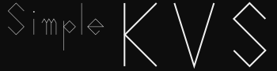

# Simple-KVS

[](https://github.com/kumaS-nu/Simple-KVS/blob/master/LICENSE)
[](https://github.com/kumaS-nu/Simple-KVS/actions)
[](https://github.com/kumaS-nu/Simple-KVSy/releases)
[](https://github.com/kumaS-nu/Simple-KVS/releases)
[](https://www.codefactor.io/repository/github/kumaS-nu/Simple-KVS)
[](https://openupm.com/packages/org.kumas.simple-kvs/)



このライブラリはとてもシンプルなUnity向けのKey Value Store (**Server**ではない)を提供します。
このKVSは以下の用途で役に立ちます。
- シーン間のデータの受け渡し
- データの保存と読み込み

## 特徴

- とても単純な実装とAPI
- 容易な外部シリアライザへの連帯
- デフォルトで以下の内部シリアライザ2種と外部シリアライザ6種との連帯
    - JsonUtility
    - XmlSerializer
    - Json.net
    - System.Text.Json
    - NetSerializer
    - Protobuf-net
    - MessagePack
    - MemoryPack

## インストール方法

### UPM (Unity Package Manager) を使う

 UPMを使って導入するには、このGit URLを指定する。または、OpenUPMを使って導入するという二通りあります。

#### Git URL を指定する

1. Package Managerウィンドウを開く
1. ステータスバーの **Add** (+) ボタンをクリック
1. **Add package from git URL** を選択
1. 「`https://github.com/kumaS-nu/Simple-KVS.git?path=Simple-KVS/Packages/Simple KVS`」または「`git@github.com:kumaS-nu/Simple-KVS.git?path=Simple-KVS/Packages/Simple KVS`」を入力
1. **Add** をクリック

詳細は[公式ページ(Git URL からのインストール - Unity)](https://docs.unity3d.com/ja/2019.4/Manual/upm-ui-giturl.html)をご覧ください。

#### OpenUPM を利用する

1. OpenUPM-CLI をインストールしていない場合は、以下のコマンドで OpenUPM-CLI をインストールする。(Node.js 12が必要です。)
    ``` bash
    npm install -g openupm-cli
    ```
1. インストールする予定のプロジェクトのフォルダへ移動する。
1. 以下のコマンドで、プロジェクトにインストールする。
    ``` bash
    openupm add org.kumas.simple-kvs
    ```

詳細は[公式ページ(Getting Started with OpenUPM-CLI - OpenUPM)](https://openupm.com/docs/getting-started.html)をご覧ください。

### .unitypackage で導入する

1. [リリースページ](https://github.com/kumaS-nu/Simple-KVS/releases)へ行き、必要なバージョンのzipファイルをダウンロードする。
1. zipファイルを解凍し、中の .unitypackage をプロジェクトにインポートする。

## 使い方

このKVSには`InMemoryKVS<T>`・`InMemoryKVS4UnityObject<T>`・`InFileKVS<S>`・`InFileKVS4UnityObject<S>`があります。

### `InMemoryKVS<T>`

メモリ内に保存します。`Unity.Object`を継承したクラス（`MonoBehaviour`など）は使えません。`InMemoryKVS4UnityObject<T>`を使用して下さい。

```csharp

var data = new Data { someData = "someData" };

// メモリにデータを渡す。キーは型ごとに保存される。
InMemoryKVS<Data>.Set("data_key", data);

// メモリからデータを受け取る。デフォルトでは取得するとデータは消去されるため注意。
var received = InMemoryKVS<Data>.Get("data_key");

// もちろんTryGetもできる。
var (isStored, value) = InMemoryKVS<Data>.TryGet("data_key");

```

### `InMemoryKVS4UnityObject<T>`

`InMemoryKVS<T>`とほぼ変わりません。ただし、データは`ISerializable`を実装する必要があります。

```csharp

class Sample : MonoBehaviour, ISerializable
{
    private string someData;

    public object Serialize()
    {
        // Unity.Objectを継承しない何らかのデータにシリアライズする。
    }

    public void Deserialize(object data)
    {
        // 保存したデータをこのインスタンスに適用する。
    }
}

// メモリにデータを渡す。キーは型名ごとに保存される。
InMemoryKVS4Unity<Sample>.Set("data_key", data);

// メモリからデータを受け取る。デフォルトでは取得するとデータは消去されるため注意。
InMemoryKVS4UnityObject<Sample>.Get("data_key", received);

// もちろんTryGetもできる。
isStored = InMemoryKVS4UnityObject<Sample>.TryGet("data_key", value);

```

### `InFileKVS<S>`

ファイルに保存します。ジェネリクスの型は使用するシリアライザを指定し`ISerializer`を継承する必要があります。`Unity.Object`を継承したクラス（`MonoBehaviour`など）は使えません。`InFileKVS4UnityObject<T>`を使用して下さい。

```csharp

var data = new Data { someData = "someData" };

// ファイルにデータを保存する。キーは型名ごとに保存される。
InFileKVS<JsonUtilitySerializer>.Set<Data>("data_key", data);

// ファイルからデータを取得する。
var received = InFileKVS<JsonUtilitySerializer>.Get<Data>("data_key");

// もちろんTryGetもできる。
var (isStored, value) = InFileKVS<JsonUtilitySerializer>.TryGet<Data>("data_key");

// 非同期にも対応。
var received2 = await InFileKVS<JsonUtilitySerializer>.GetAsync<Data>("data_key");

```

### `InFileKVS4UnityObject<S>`

`InFileKVS<S>`とほぼ変わりません。ジェネリクスの型は使用するシリアライザを指定し`ISerializer4UnityObject`を継承する必要があります。

```csharp

var data = gameObject.GetComponent<MonoData>();

// ファイルにデータを保存する。キーは型名ごとに保存される。
InFileKVS4UnityObject<JsonUtilitySerializer>.Set<Data>("data_key", data);

var rcv = gameObject.GetComponent<MonoData>();

// ファイルからデータを取得する。
InFileKVS4UnityObject<JsonUtilitySerializer>.Get<Data>("data_key", rcv);

// もちろんTryGetもできる。
var isStored = InMemoryKVS<JsonUtilitySerializer>.TryGet<Data>("data_key", rcv);

// 非同期にも対応。
await InMemoryKVS<JsonUtilitySerializer>.GetAsync<Data>("data_key", rcv);

```

## 詳細

より詳しい情報などは https://kumaS-nu.github.io/Simple-KVS をご覧ください。

## ライセンス

このライブラリのライセンスは[MIT License](LICENSE)です。