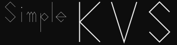

# Simple-KVS

[](https://github.com/kumaS-nu/Simple-KVS/blob/master/LICENSE)
[](https://github.com/kumaS-nu/Simple-KVS/actions)
[](https://github.com/kumaS-nu/Simple-KVSy/releases)
[](https://github.com/kumaS-nu/Simple-KVS/releases)
[](https://www.codefactor.io/repository/github/kumaS-nu/Simple-KVS)
[](https://openupm.com/packages/org.kumas.simple-kvs/)



[日本語はこちら。](README_jp.md)

This library provides a very simple Key Value Store (not **Server**) for Unity.
This KVS is helpful for the following purposes.
- Transferring data between scenes
- Save and load the data

## Feature

- Very simple API and implementation
- Easy integration with external serializers
- Integration with two internal serializers and six external serializers by default
    - JsonUtility
    - XmlSerializer
    - Json.net
    - System.Text.Json
    - NetSerializer
    - Protobuf-net
    - MessagePack
    - MemoryPack

## Installation

### via UPM (Unity Package Manager)

 There are two ways to install the package: using the UPM (Unity Package Manager) or importing the .unitypackage.

#### Use This Git URL

1. Open the Package Manager window.
1. Click the **add** (+) button in the status bar.
1. Select **Add package from git URL**.
1. Enter "`https://github.com/kumaS-nu/Simple-KVS.git?path=Simple-KVS/Packages/Simple KVS`" or "`git@github.com:kumaS-nu/Simple-KVS.git?path=Simple-KVS/Packages/Simple KVS`".
1. Click **Add**.

 For more information, see the [Official page (Installing from a Git URL - Unity)](https://docs.unity3d.com/Manual/upm-ui-giturl.html).

#### Use OpenUPM

1. If you have not installed OpenUPM-CLI, run the following command to install OpenUPM-CLI. (Node.js 12 is required.)
    ```bash
    npm install -g openupm-cli
    ```
1. Go to the unity project folder
1. Run the following command to install "NuGet importer for Unity" in your project.
    ```bash
    openupm add org.kumas.simple-kvs
    ```

 For more information, see the [Official page (Getting Started with OpenUPM-CLI - OpenUPM)](https://openupm.com/docs/getting-started.html)

### via .unitypackage

1. Go to the [release page](https://github.com/kumaS-nu/Simple-KVS/releases) and download the zip file of the version you need.
1. Extract the zip file and import the .unitypackage into your project.

## Quick Start

This KVS has `InMemoryKVS<T>`, `InMemoryKVS4UnityObject<T>`, `InFileKVS<S>` and `InFileKVS4UnityObject<S>`.

### `InMemoryKVS<T>`

Store data in memory. This class cannot store the data inherited from `Unity.Object` (such as `MonoBehaviour`). Instead, use `InMemoryKVS4UnityObject<T>` for these data.

```csharp

var data = new Data { someData = "someData" };

// Store the data in memory. Keys are recorded by each type.
InMemoryKVS<Data>.Set("data_key", data);

// Get the data from memory. Note that data is deleted in memory when getting data by default.
var received = InMemoryKVS<Data>.Get("data_key");

// Of course, you can also use TryGet().
var (isStored, value) = InMemoryKVS<Data>.TryGet("data_key");

```

### `InMemoryKVS4UnityObject<T>`

`InMemoryKVS4UnityObject<T>` is almost the same as `InMemoryKVS<T>.` However, the storing data must implement `ISerializable.`

```csharp

class Sample : MonoBehaviour, ISerializable
{
    private string someData;

    public object Serialize()
    {
        // Serialize some data that does not inherit Unity.Object.
    }

    public void Deserialize(object data)
    {
        // Apply the stored data to this instance.
    }
}

// Store the data in memory. Keys are recorded by each type.
InMemoryKVS4Unity<Sample>.Set("data_key", data);

var rcv = gameObject.GetComponent<Sample>();

// Get the data from memory. Note that data is deleted in memory when getting data by default.
InMemoryKVS4UnityObject<Sample>.Get("data_key", rcv);

// Of course, you can also use TryGet().
var isStored = InMemoryKVS4UnityObject<Sample>.TryGet("data_key", rcv);

```

### `InFileKVS<S>`

Save the data to a file. The generics type specifies the serializer to use and must inherit from `ISerializer`. `InFileKVS<S>` cannot store the data inherited from `Unity.Object` (such as `MonoBehaviour`). Instead, use `InFileKVS4UnityObject<S>` for these data.

```csharp

var data = new Data { someData = "someData" };

// Save the data in file. Keys are recorded by each type.
InFileKVS<JsonUtilitySerializer>.Set<Data>("data_key", data);

// Load data from file.
var received = InFileKVS<JsonUtilitySerializer>.Get<Data>("data_key");

// Of course, you can also use TryGet().
var (isStored, value) = InFileKVS<JsonUtilitySerializer>.TryGet<Data>("data_key");

// Asynchronous API is also available.
var received2 = await InFileKVS<JsonUtilitySerializer>.GetAsync<Data>("data_key");

```

### `InFileKVS4UnityObject<S>`

`InFileKVS4UnityObject<S>` is almost the same as `InFileKVS<S>`. The generics type specifies the serializer to use and must inherit from `ISerializer4UnityObject`.

```csharp

var data = gameObject.GetComponent<MonoData>();

// Save the data in file. Keys are recorded by each type.
InFileKVS4UnityObject<JsonUtilitySerializer>.Set<Data>("data_key", data);

var rcv = gameObject.GetComponent<MonoData>();

// Load data from file.
InFileKVS4UnityObject<JsonUtilitySerializer>.Get<Data>("data_key", rcv);

// Of course, you can also use TryGet().
var isStored = InMemoryKVS<JsonUtilitySerializer>.TryGet<Data>("data_key", rcv);

// Asynchronous API is also available.
await InMemoryKVS<JsonUtilitySerializer>.GetAsync<Data>("data_key", rcv);

```

## More Infomation

For more information or contributions, please see https://kumaS-nu.github.io/Simple-KVS .

## License

This package is under [MIT License](LICENSE).
